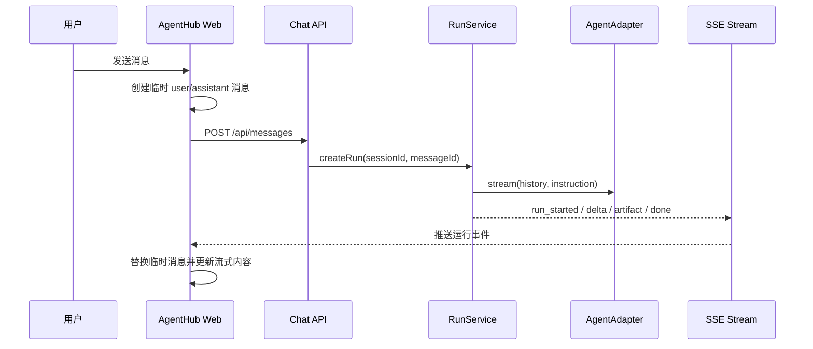
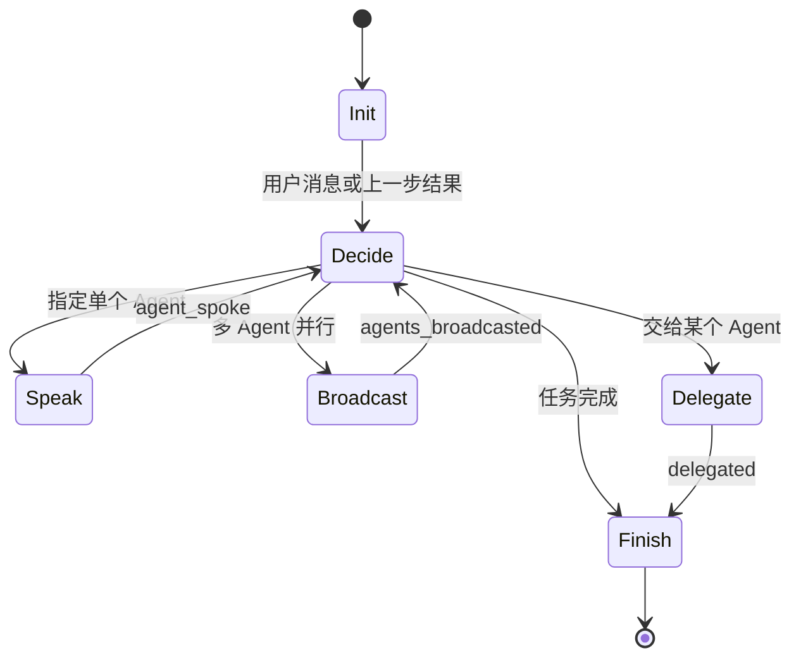
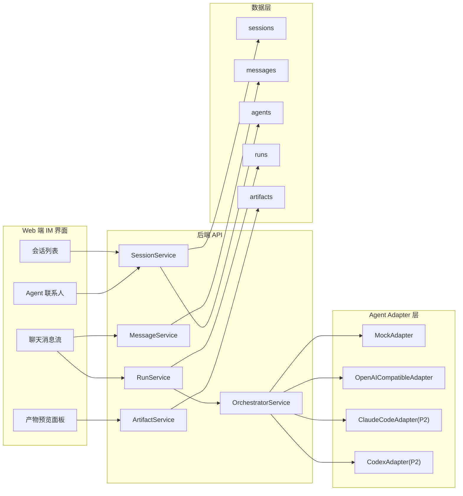
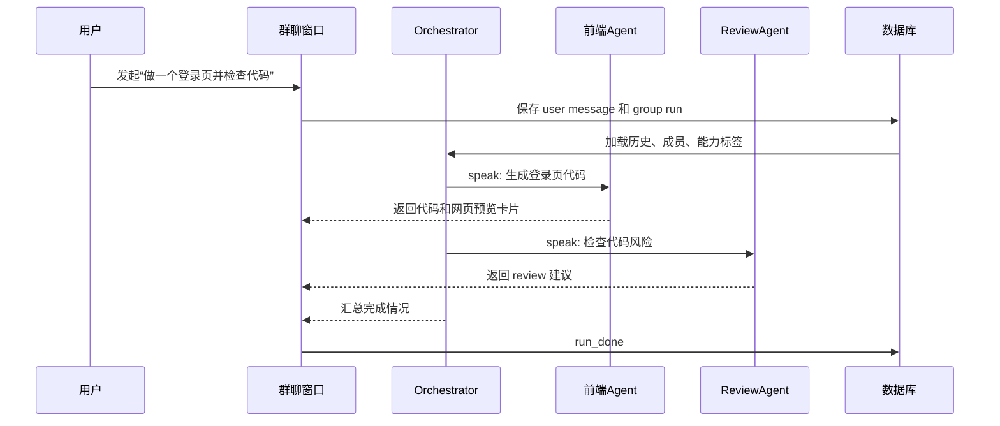

# AgentHub 借鉴 LobeHub 源码的落地方案

> 课题目标：构建一个以 IM 聊天为核心交互范式的多 Agent 协作平台 AgentHub。本文从 LobeHub 源码实现出发，结合本目录已有的 `lobehub-multi-agent-architecture.html` 分析报告，提炼 AgentHub 可以直接借鉴的架构思想、可以简化的实现方式，以及适合课程 Demo 的开发路线。

## 1. 文档结论

AgentHub 不应该简单复刻 LobeHub 的全量系统。LobeHub 是生产级 AI 工作空间，包含插件市场、知识库、远程设备、桌面网关、云沙箱、多模型服务、队列和复杂权限。课程项目需要的是一个能跑通核心链路、能讲清架构、能展示产品感的简化实战版。

建议 AgentHub 借鉴 LobeHub 的四个核心抽象：

| LobeHub 核心思想         | AgentHub 落地方式                                         | 价值                          |
| -------------------- | ----------------------------------------------------- | --------------------------- |
| IM 是主交互入口            | 左侧会话列表，中间消息流，右侧产物预览                                   | 用户理解成本低，Demo 展示直观           |
| Agent 是聊天对象          | 每个 Agent 有头像、名称、能力标签、系统提示词、适配器类型                      | 满足“多 Agent 接入”和“自建 Agent”要求 |
| Operation/Run 表示一次运行 | 每条用户消息触发一个 run，记录状态、步骤、错误和流式输出                        | 方便恢复、取消、答辩解释                |
| Supervisor 协调群聊      | Orchestrator 根据用户意图选择 speak、broadcast、delegate、finish | 支撑群聊协作和任务拆解                 |

课程 Demo 的优先级建议：

1. 先做 Web 端 IM 体验和单 Agent 对话。
2. 再做群聊 Orchestrator，跑通两个以上 Agent 的顺序回复或并行回复。
3. 再做产物卡片，如代码块、网页预览、Diff 卡片的简化版。
4. 最后把 Claude Code、Codex、OpenCode 作为统一 `AgentAdapter` 的不同实现或设计预留。

## 2. LobeHub 源码依据

本文主要参考以下 LobeHub 源码路径和已有 HTML 分析：

| 模块             | 源码位置                                                                                                                                                                                                                    | 对 AgentHub 的启发                                                      |
| -------------- | ----------------------------------------------------------------------------------------------------------------------------------------------------------------------------------------------------------------------- | ------------------------------------------------------------------- |
| 群聊发送入口         | [`src/store/chat/slices/aiAgent/actions/agentGroup.ts`](https://raw.githubusercontent.com/lobehub/lobehub/main/src/store/chat/slices/aiAgent/actions/agentGroup.ts)                                                     | 前端先创建临时消息，再调用服务端，最后通过 SSE 同步结果                                      |
| 群组编排 action    | [`src/store/chat/slices/aiAgent/actions/groupOrchestration.ts`](https://raw.githubusercontent.com/lobehub/lobehub/main/src/store/chat/slices/aiAgent/actions/groupOrchestration.ts)                                     | 群聊工具回调触发 `triggerSpeak`、`triggerBroadcast`、`triggerExecuteTask` 等动作 |
| 编排 Runtime     | [`packages/agent-runtime/src/groupOrchestration/GroupOrchestrationRuntime.ts`](https://raw.githubusercontent.com/lobehub/lobehub/main/packages/agent-runtime/src/groupOrchestration/GroupOrchestrationRuntime.ts)       | Runtime 只负责 Supervisor 和 Executor 之间的循环                             |
| Supervisor 状态机 | [`packages/agent-runtime/src/groupOrchestration/GroupOrchestrationSupervisor.ts`](https://raw.githubusercontent.com/lobehub/lobehub/main/packages/agent-runtime/src/groupOrchestration/GroupOrchestrationSupervisor.ts) | 根据上一步结果决定下一步指令，如 `call_agent`、`parallel_call_agents`、`finish`       |
| 服务端 Agent 执行   | [`src/server/services/aiAgent/index.ts`](https://raw.githubusercontent.com/lobehub/lobehub/main/src/server/services/aiAgent/index.ts)                                                                                   | `execAgent` 负责读取 Agent 配置、创建消息、发现工具、创建 operation                    |
| 服务端运行服务        | [`src/server/services/agentRuntime/AgentRuntimeService.ts`](https://raw.githubusercontent.com/lobehub/lobehub/main/src/server/services/agentRuntime/AgentRuntimeService.ts)                                             | `createOperation` 和 `executeStep` 把一次 Agent 运行拆成可追踪步骤               |
| 本地分析报告         | `D:\HDUCSHomework\AgentHub\lobehub-multi-agent-architecture.html`                                                                                                                                                       | 已整理 LobeHub 群聊链路、运行位置和编译验证方式                                        |

需要特别注意：LobeHub 当前存在两条相关链路，一条是服务端化的群聊主发送路径，另一条是客户端 store 中的 GroupOrchestration 编排路径。AgentHub 不需要照搬这种复杂分层，可以统一设计为“后端 RunService + OrchestratorService + AdapterService”，让课程 Demo 更清晰。

## 3. LobeHub 群聊主链路如何工作

LobeHub 的群聊发送入口在 `agentGroup.ts`。它的核心流程可以概括为：

1. 用户在群聊输入框发送消息。
2. 前端 `sendGroupMessage` 创建临时 user message 和 assistant loading message。
3. 调用 `lambdaClient.aiAgent.execGroupAgent.mutate`。
4. 服务端创建真实消息、topic 和 operation。
5. 前端用服务端返回的真实消息替换临时消息。
6. 前端通过 `agentRuntimeClient.createStreamConnection(operationId)` 建立 SSE。
7. 服务端运行过程中持续推送 Agent runtime event。
8. 前端根据 stream event 更新消息内容、工具结果和完成状态。

这个设计的关键不是具体框架，而是“先给用户即时反馈，再异步启动 Agent，再流式同步状态”。AgentHub 应该保留这个体验。



### AgentHub 的简化实现

LobeHub 使用 tRPC、数据库模型、队列服务和 SSE 管理完整 operation。AgentHub 可以简化为：

| LobeHub 源码能力                          | AgentHub 简化能力                               |
| ------------------------------------- | ------------------------------------------- |
| `sendGroupMessage`                    | `sendMessage(sessionId, content, mentions)` |
| `execGroupAgent`                      | `POST /api/chat/group/run`                  |
| `AgentRuntimeService.createOperation` | `RunService.createRun`                      |
| `AgentRuntimeService.executeStep`     | `RunService.stepRun` 或内存任务执行器               |
| `createStreamConnection(operationId)` | `GET /api/runs/:runId/events`               |
| assistant loading message             | `status = streaming` 的 assistant 消息         |

推荐 AgentHub 在 Demo 阶段使用 SSE，而不是 WebSocket。SSE 足够支持单向流式输出，实现成本低，也符合 Agent 输出的主要方向。

## 4. LobeHub 多 Agent 编排如何工作

LobeHub 的多 Agent 编排核心在 `GroupOrchestrationRuntime` 和 `GroupOrchestrationSupervisor`。

它把群聊协作拆成三个角色：

| 角色         | LobeHub 中的职责                     | AgentHub 中的职责               |
| ---------- | -------------------------------- | --------------------------- |
| Supervisor | 接收上一步结果，决定下一条指令                  | Orchestrator 根据用户任务和历史选择下一步 |
| Runtime    | 循环调用 Supervisor 和 Executor       | 控制编排循环、最大轮数、取消和错误           |
| Executor   | 执行具体指令，如调用某个 Agent 或并行调用多个 Agent | 调用 AgentAdapter，写消息，生成产物卡片  |

LobeHub 的 Supervisor 状态机包含这些典型决策：

| 决策              | 含义             | AgentHub 是否实现 |
| --------------- | -------------- | ------------- |
| `speak`         | 指定一个 Agent 发言  | 必做            |
| `broadcast`     | 多个 Agent 并行发言  | 建议做           |
| `delegate`      | 委派给某个 Agent 接管 | 可做简化版         |
| `execute_task`  | 创建异步子任务        | P2            |
| `execute_tasks` | 批量异步子任务        | P2            |
| `finish`        | 编排结束           | 必做            |

AgentHub 的 Orchestrator 可以先不调用真实大模型决策，而是用“规则 + 可选 LLM”：

1. 如果用户显式 `@前端Agent`，则 `speak(frontend-agent)`。
2. 如果用户显式 `@多个Agent`，则 `broadcast([agentA, agentB])`。
3. 如果用户说“做一个网页/组件/页面”，则先让“产品 Agent”产出需求，再让“前端 Agent”产出代码。
4. 如果用户说“检查/优化/评审”，则让“Reviewer Agent”发言。
5. 当所有计划步骤执行完，Orchestrator 发送总结消息并 `finish`。



### AgentHub 编排伪代码

```ts
type OrchestratorDecision =
  | { type: 'speak'; agentId: string; instruction: string }
  | { type: 'broadcast'; agentIds: string[]; instruction: string }
  | { type: 'delegate'; agentId: string; reason?: string }
  | { type: 'finish'; reason?: string };

async function runGroupChat(sessionId: string, userMessageId: string) {
  const state = await runService.createRun({ sessionId, userMessageId, mode: 'group' });
  let round = 0;

  while (round < 6 && state.status !== 'done') {
    const decision = await orchestrator.decideNextStep(sessionId, state);

    if (decision.type === 'finish') {
      await runService.finishRun(state.runId, decision.reason);
      break;
    }

    const result = await executor.executeDecision(sessionId, decision);
    await runService.appendStep(state.runId, decision, result);
    round += 1;
  }
}
```

这里的重点是控制复杂度：课程 Demo 不需要实现 LobeHub 的完整 `execute_task` 和 thread isolation。先把 `speak`、`broadcast`、`finish` 跑通，就能体现多 Agent 协作能力。

## 5. AgentHub 总体架构设计



### 前端页面结构

建议采用三栏 IM 布局：

| 区域  | 功能                            |
| --- | ----------------------------- |
| 左栏  | 会话列表，支持新建、搜索、置顶、归档、最近活跃排序     |
| 中栏  | 当前聊天消息流，支持文本、代码块、产物卡片、运行状态    |
| 右栏  | Agent 信息、上下文 pin、产物预览、简单代码查看器 |

核心组件建议：

| 组件                  | 职责                            |
| ------------------- | ----------------------------- |
| `ConversationList`  | 展示会话、创建单聊/群聊、切换会话             |
| `ChatPanel`         | 展示消息流和输入框                     |
| `MessageBubble`     | 根据消息类型渲染文本、代码、卡片、错误           |
| `AgentMentionInput` | 支持 `@Agent` 的输入体验             |
| `ArtifactCard`      | 网页预览、代码文件、Diff、部署状态的统一卡片      |
| `PreviewPanel`      | 展开产物预览，Demo 阶段重点做 iframe 网页预览 |

## 6. 最小数据模型

AgentHub 的数据模型要足够支撑“上下文连续”和“运行可追踪”，但不要过度设计。

### `agents`

| 字段                          | 说明                                               |
| --------------------------- | ------------------------------------------------ |
| `id`                        | Agent ID                                         |
| `name`                      | 展示名称，如 Claude Code、Codex、前端专家                    |
| `avatar`                    | 头像 URL 或本地图标                                     |
| `description`               | 简短说明                                             |
| `tags`                      | 能力标签，如 code、review、design                        |
| `system_prompt`             | 自建 Agent 的系统提示词                                  |
| `adapter_type`              | `mock`、`openai-compatible`、`claude-code`、`codex` |
| `config_json`               | 模型、baseURL、命令行参数等配置                              |
| `created_at` / `updated_at` | 时间                                               |

### `sessions`

| 字段                 | 说明                        |
| ------------------ | ------------------------- |
| `id`               | 会话 ID                     |
| `title`            | 会话标题                      |
| `mode`             | `single` 或 `group`        |
| `primary_agent_id` | 单聊 Agent 或群聊 Orchestrator |
| `pinned`           | 是否置顶                      |
| `archived`         | 是否归档                      |
| `last_active_at`   | 最近活跃时间                    |

### `session_members`

| 字段           | 说明                        |
| ------------ | ------------------------- |
| `session_id` | 会话 ID                     |
| `agent_id`   | 成员 Agent ID               |
| `role`       | `member` 或 `orchestrator` |

### `messages`

| 字段              | 说明                                   |
| --------------- | ------------------------------------ |
| `id`            | 消息 ID                                |
| `session_id`    | 所属会话                                 |
| `sender_type`   | `user`、`agent`、`system`              |
| `sender_id`     | 用户 ID 或 Agent ID                     |
| `role`          | `user`、`assistant`、`tool`、`system`   |
| `content`       | 文本内容                                 |
| `status`        | `pending`、`streaming`、`done`、`error` |
| `parent_id`     | 引用或回复的父消息                            |
| `metadata_json` | mentions、模型、错误、token 等               |
| `created_at`    | 创建时间                                 |

### `runs`

| 字段                          | 说明                                             |
| --------------------------- | ---------------------------------------------- |
| `id`                        | Run ID，等价于 LobeHub operation 的简化版              |
| `session_id`                | 会话 ID                                          |
| `trigger_message_id`        | 触发运行的用户消息                                      |
| `mode`                      | `single` 或 `group`                             |
| `status`                    | `queued`、`running`、`done`、`failed`、`cancelled` |
| `step_count`                | 已执行步骤数                                         |
| `error`                     | 失败信息                                           |
| `created_at` / `updated_at` | 时间                                             |

### `artifacts`

| 字段              | 说明                                          |
| --------------- | ------------------------------------------- |
| `id`            | 产物 ID                                       |
| `message_id`    | 关联消息                                        |
| `type`          | `code`、`web_preview`、`diff`、`file`、`deploy` |
| `title`         | 卡片标题                                        |
| `content`       | 代码、HTML、Diff 或文本                            |
| `url`           | 预览 URL 或文件 URL                              |
| `metadata_json` | 语言、文件名、状态等                                  |

### `pinned_contexts`

| 字段           | 说明        |
| ------------ | --------- |
| `id`         | Pin ID    |
| `session_id` | 会话 ID     |
| `message_id` | 被 pin 的消息 |
| `note`       | 用户备注      |

## 7. 后端接口设计

AgentHub 可以采用 REST API，降低实现和答辩复杂度。

| 接口                           | 方法     | 说明                 |
| ---------------------------- | ------ | ------------------ |
| `/api/agents`                | `GET`  | 获取 Agent 联系人列表     |
| `/api/agents`                | `POST` | 创建自定义 Agent        |
| `/api/sessions`              | `GET`  | 获取会话列表             |
| `/api/sessions`              | `POST` | 新建单聊或群聊            |
| `/api/sessions/:id/messages` | `GET`  | 获取会话消息历史           |
| `/api/messages`              | `POST` | 发送用户消息             |
| `/api/chat/single/run`       | `POST` | 单 Agent 运行         |
| `/api/chat/group/run`        | `POST` | 群聊 Orchestrator 运行 |
| `/api/runs/:id/events`       | `GET`  | SSE 运行事件           |
| `/api/runs/:id/cancel`       | `POST` | 取消运行               |
| `/api/artifacts/:id`         | `GET`  | 获取产物详情             |

推荐事件类型：

```ts
type RunEvent =
  | { type: 'run_started'; runId: string }
  | { type: 'agent_started'; agentId: string; messageId: string }
  | { type: 'text_delta'; messageId: string; delta: string }
  | { type: 'artifact_created'; messageId: string; artifactId: string }
  | { type: 'agent_done'; agentId: string; messageId: string }
  | { type: 'run_done'; runId: string }
  | { type: 'run_error'; runId: string; message: string };
```

这个事件模型对应 LobeHub 的 SSE 思路，但字段更少，适合 Demo。

## 8. Agent Adapter 层设计

LobeHub 在 `execAgent` 中支持普通模型调用，也支持 Claude Code、Codex 这类异构 Agent。源码中能看到它会识别 `claude-code`、`codex`，然后走 device gateway 或 cloud sandbox。AgentHub 不需要先实现完整沙箱，可以抽象统一 Adapter 接口。

```ts
export interface AgentAdapter {
  type: string;
  run(input: AgentRunInput): AsyncIterable<AgentRunEvent>;
}

export interface AgentRunInput {
  agent: AgentConfig;
  session: Session;
  messages: Message[];
  instruction: string;
  artifacts?: Artifact[];
}

export type AgentRunEvent =
  | { type: 'text_delta'; delta: string }
  | { type: 'artifact'; artifact: ArtifactDraft }
  | { type: 'done' }
  | { type: 'error'; message: string };
```

优先实现两个 Adapter：

| Adapter                   | 用途                                    |
| ------------------------- | ------------------------------------- |
| `MockAdapter`             | 演示稳定，不依赖外部 API，可以按 Agent 类型返回不同风格内容   |
| `OpenAICompatibleAdapter` | 接入 OpenAI-compatible API，满足真实 AI 生成能力 |

P2 再实现：

| Adapter             | 简化实现                           |
| ------------------- | ------------------------------ |
| `ClaudeCodeAdapter` | 后端调用本机 CLI 或展示设计预留，不做云沙箱       |
| `CodexAdapter`      | 通过 CLI 或 API 适配，输出文本、Diff、文件产物 |
| `OpenCodeAdapter`   | 作为第三方命令行 Agent 的统一命令模板         |

答辩时可以说明：LobeHub 的异构 Agent 设计说明真实 Agent 不一定都是普通 LLM API，所以 AgentHub 通过 Adapter 层隔离差异。

## 9. 单聊和群聊运行逻辑

### 单聊

单聊是最小闭环：

1. 用户创建会话并选择一个 Agent。
2. 用户发送消息。
3. 后端保存 user message。
4. 创建 assistant message 和 run。
5. `RunService` 加载历史消息作为上下文。
6. 调用对应 `AgentAdapter`。
7. 流式写入 assistant message。
8. 如果 Adapter 产生 artifact，则创建产物卡片。

### 群聊

群聊在单聊基础上加 Orchestrator：

1. 用户创建群聊，选择 Orchestrator 和多个成员 Agent。
2. 用户发送消息，可 `@` 指定 Agent。
3. 后端创建 group run。
4. Orchestrator 读取用户消息、成员能力、历史上下文。
5. Orchestrator 输出决策：`speak`、`broadcast`、`delegate`、`finish`。
6. Executor 调用对应 AgentAdapter。
7. 每个 Agent 的输出都作为群聊消息展示。
8. Orchestrator 最后生成总结消息。



## 10. 与 LobeHub 的取舍

AgentHub 要“学架构”，不是“堆功能”。建议取舍如下：

| LobeHub 能力           | AgentHub 处理方式         | 原因                  |
| -------------------- | --------------------- | ------------------- |
| tRPC + 多层 service    | REST API + 少量 service | 课程 Demo 更易实现和讲解     |
| 完整队列服务               | 内存任务队列或普通 async job   | 单机 Demo 足够          |
| QStash / 分布式锁        | run 状态字段 + 简单取消标记     | 不需要分布式部署            |
| 插件市场和 MCP            | 先做固定工具和产物卡片           | 避免范围失控              |
| 云沙箱和远程设备             | P2 预留 CLI Adapter     | 主要展示统一适配思想          |
| 复杂知识库                | pin 关键消息 + 最近 N 条历史   | 满足上下文连续             |
| 子任务 isolation thread | P2 任务消息               | 先跑通 speak/broadcast |
| 多端支持                 | 先 Web，桌面/移动写设计预留      | 符合交付优先级             |

保留的核心能力：

1. 会话列表和聊天流。
2. Agent 联系人和自建 Agent。
3. Run/Operation 状态追踪。
4. SSE 流式输出。
5. 群聊 Orchestrator 状态机。
6. 产物卡片预览。

## 11. 实现路线

### 阶段 1：IM 基础和单聊闭环

目标：完成最小可运行 Demo。

功能：

1. 会话列表：新建、搜索、置顶、归档。
2. Agent 列表：内置 3 个 Agent，如产品 Agent、前端 Agent、评审 Agent。
3. 单聊消息：发送、展示历史、流式回复。
4. Run 状态：pending、running、done、error。
5. MockAdapter：不依赖外部 API，保证演示稳定。

验收：

1. 新建一个“前端 Agent”单聊。
2. 发送“写一个 React 登录页”。
3. 页面出现用户消息、Agent 流式回复、代码块。
4. 刷新页面后消息历史还在。

### 阶段 2：群聊 Orchestrator

目标：体现多 Agent 协作能力。

功能：

1. 创建群聊并选择多个 Agent。
2. 输入框支持 `@Agent`。
3. Orchestrator 支持 `speak`、`broadcast`、`finish`。
4. Agent 依次或并行回复，消息中显示 Agent 身份。
5. Orchestrator 最后汇总。

验收：

1. 群聊中发送“@前端Agent @评审Agent 做一个登录页并检查问题”。
2. 前端 Agent 输出代码和预览卡片。
3. 评审 Agent 输出改进建议。
4. Orchestrator 汇总“已完成页面生成和代码评审”。

### 阶段 3：产物卡片和预览

目标：提升生成效果质量和产品感。

功能：

1. 支持代码卡片：语言、复制、展开。
2. 支持网页预览卡片：iframe 展示 HTML 结果。
3. 支持 Diff 卡片简化版：展示 before/after 或 unified diff。
4. 右侧 PreviewPanel 展开产物详情。

验收：

1. Agent 回复 HTML 产物后，聊天流出现网页预览卡片。
2. 点击卡片后右侧面板展示完整预览。
3. 代码块可复制。

### 阶段 4：真实 Adapter 和答辩材料

目标：支撑“多 Agent 接入”和课程交付。

功能：

1. OpenAI-compatible Adapter 接入真实模型。
2. 自建 Agent 表单：名称、头像、标签、system prompt、adapter。
3. AI 协作开发记录：保存 spec、rules、prompt、关键对话摘要。
4. 3 分钟 Demo 视频脚本和演示数据。

验收：

1. 至少一个真实模型 Agent 可以回复。
2. 用户能创建一个自定义 Agent。
3. 文档中能展示 AI 协作规范和开发记录。

## 12. Demo 验收场景

| 场景    | 操作               | 期望结果                          |
| ----- | ---------------- | ----------------------------- |
| 单聊创建  | 新建会话，选择前端 Agent  | 左侧出现新会话，中间进入聊天                |
| 单聊上下文 | 连续发送两轮修改要求       | Agent 能引用上一轮代码或需求             |
| 群聊协作  | 群聊中 @两个 Agent    | Orchestrator 分派，两个 Agent 依次回复 |
| 产物预览  | Agent 生成 HTML 页面 | 聊天流出现网页预览卡片                   |
| 错误降级  | 某 Agent 模拟失败     | 展示错误卡片，Orchestrator 汇总可用结果    |
| 刷新恢复  | 刷新浏览器            | 会话、消息、产物、run 状态可恢复            |

## 13. 答辩讲解重点

### 为什么采用 IM 范式

IM 是用户最熟悉的协作界面。LobeHub 的源码也把 Agent 运行入口放在聊天 store、消息流和会话上下文中。AgentHub 借鉴这一点，把每个 Agent 看作聊天联系人，把任务过程沉淀为消息历史，天然支持多轮修改、引用、回看和群聊协作。

### Orchestrator 如何决策

AgentHub 的 Orchestrator 是 LobeHub `GroupOrchestrationSupervisor` 的简化版。它不直接执行任务，只输出下一步决策：

1. `speak`：让一个 Agent 发言。
2. `broadcast`：让多个 Agent 发言。
3. `delegate`：交给某个 Agent 接管。
4. `finish`：结束并总结。

真正调用 Agent 的逻辑放在 Executor 或 Adapter 层，这样调度和执行分离，结构清楚。

### 上下文如何传给 Agent

每次运行时，`RunService` 会加载：

1. 当前会话最近 N 条消息。
2. 用户 pin 的关键消息。
3. 当前 Agent 的 system prompt。
4. 群聊中 Orchestrator 分配的 instruction。
5. 相关产物摘要，如文件名、代码片段、预览链接。

这对应 LobeHub 中“聊天历史 + agent config + tools + metadata”一起构造 runtime context 的思路，但 AgentHub 只保留课程 Demo 必需字段。

### 为什么要有 Run/Operation

如果只把 Agent 回复当作普通消息，就很难处理流式输出、取消、失败、重试和调度过程。LobeHub 使用 operation 管理运行状态，AgentHub 用 `runs` 表做简化版。答辩时可以说明：消息是用户看到的结果，run 是系统内部追踪任务执行过程的记录。

### 哪些 LobeHub 能力被简化

AgentHub 不照搬插件市场、远程设备、云沙箱和完整队列系统，因为课程 Demo 的核心是 IM 体验、多 Agent 调度和产物预览。简化后系统更容易实现，也更容易解释核心逻辑。

## 14. 交付物映射

| 课程交付物        | AgentHub 对应内容                              |
| ------------ | ------------------------------------------ |
| 产品设计文档       | IM 三栏布局、Agent 联系人、群聊协作、产物卡片、用户流程           |
| 技术文档         | 本文档、架构图、数据模型、API、Orchestrator 状态机          |
| 可运行 Demo     | Web 端单聊、群聊、流式回复、产物预览                       |
| AI 协作开发记录    | spec、rules、prompt、任务拆解、AI 生成代码记录、review 记录 |
| 3 分钟 Demo 视频 | 按“新建会话 → 群聊协作 → 产物预览 → 架构解释”录制             |

## 15. AI 协作规范建议

为了覆盖评分中的“AI 协作能力”，建议在项目中沉淀以下文件：

| 文件                             | 内容                                 |
| ------------------------------ | ---------------------------------- |
| `docs/spec.md`                 | AgentHub 产品需求和 MVP 范围              |
| `docs/architecture.md`         | 架构图、数据模型、核心链路                      |
| `docs/ai-collaboration-log.md` | 使用 AI 进行需求拆解、实现、调试、review 的记录      |
| `skills/agenthub-dev/SKILL.md` | 项目专用开发规则，如接口约定、UI 风格、测试要求          |
| `AGENTS.md`                    | 仓库级协作规则，如中文回复、避免过度设计、优先 PowerShell |

协作规则建议：

1. 每个功能先写简短 spec，再实现。
2. 每次 AI 修改代码后记录目标、改动、验证结果。
3. 复杂功能让 AI 先画链路图，再写接口。
4. 代码 review 重点检查状态流转、错误处理、消息持久化。
5. Demo 前固定一组演示数据，避免现场不可控。

## 16. 3 分钟 Demo 视频脚本

建议视频节奏：

| 时间        | 内容                                         |
| --------- | ------------------------------------------ |
| 0:00-0:25 | 展示 AgentHub 首页，说明这是一个 IM 式多 Agent 协作平台     |
| 0:25-0:55 | 新建单聊，选择前端 Agent，发送生成组件任务                   |
| 0:55-1:25 | 展示流式回复、代码块、网页预览卡片                          |
| 1:25-2:05 | 新建群聊，@前端 Agent 和评审 Agent，让 Orchestrator 分工 |
| 2:05-2:30 | 展示两个 Agent 依次回复，Orchestrator 汇总            |
| 2:30-2:50 | 展示刷新后历史保留、pin 上下文或产物展开                     |
| 2:50-3:00 | 用一张架构图总结 LobeHub 借鉴点和 AgentHub 简化实现        |

## 17. 最终建议

AgentHub 的核心不是“接入多少 Agent 平台”，而是让用户能在一个聊天空间里自然地创建任务、分派 Agent、看到过程、预览产物，并能继续追问修改。

从 LobeHub 源码中最值得借鉴的是：

1. 前端先乐观创建消息，后端异步运行，SSE 回传状态。
2. Agent 运行用 Operation/Run 管理，而不是只靠消息文本。
3. 群聊协作用 Supervisor 状态机表达，调度和执行分离。
4. Agent 接入通过统一 Adapter 层隔离差异。
5. 产物作为消息的一部分内联展示，而不是脱离聊天流。

按这个方向实现，AgentHub 可以在有限时间内覆盖课程评分中的功能完整度、AI 协作能力、生成效果质量和代码理解度，同时保留足够的产品感。
